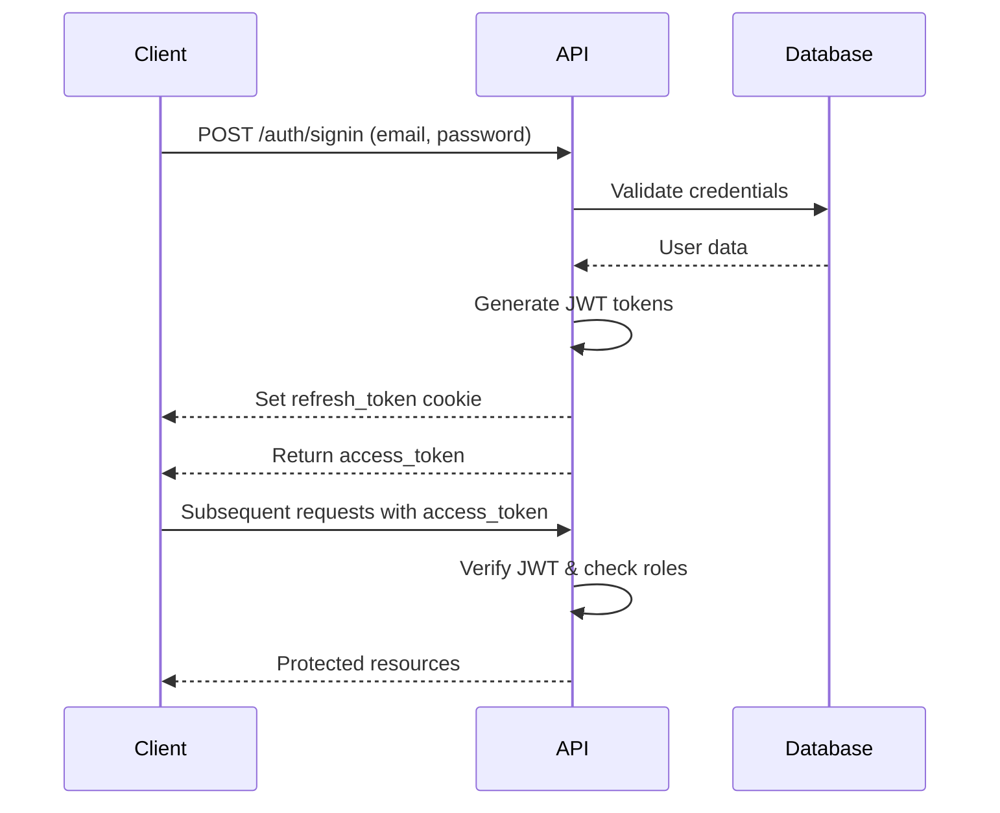

# NestJS Blog Management API 🔒📝

**A production-ready, scalable blog management system with JWT authentication and advanced security features**

[](https://nestjs.com/)
[](https://www.mongodb.com/)

## Features 🚀

### Core Functionality

- **JWT Authentication System**
  - Access token in response body
  - Refresh token in HTTP-only cookie
  - Token rotation security
  - Complete auth flow (signup, login, refresh, logout)
- **Blog Management**

  - CRUD operations for blog posts
  - Blog categories management
  - Advanced filtering and search
  - Pagination with custom page sizes

- **Security Best Practices**
  - Password hashing with bcrypt
  - HTTP-only cookies for refresh tokens
  - Environment-based configuration
  - Input validation with class-validator
  - Secure headers and CORS configuration

### Technical Highlights

- **Architecture**

  - Modular structure following NestJS best practices
  - Repository pattern implementation
  - DTO validation layers
  - Configuration management
  - Error handling strategy

- **API Features**

  - Swagger/OpenAPI documentation
  - Query parameter validation
  - Pagination metadata
  - Advanced search (title/content)
  - Filtering by multiple criteria

- **Operational Excellence**
  - Environment-specific configuration
  - Database seeding capability
  - Health check endpoint
  - Request validation pipeline
  - Structured logging

## Tech Stack 💻

| Category         | Technologies                                |
| ---------------- | ------------------------------------------- |
| **Core**         | NestJS, TypeScript, Node.js                 |
| **Database**     | MongoDB, Mongoose                           |
| **Security**     | JWT, bcrypt, cookie-parser, CSRF protection |
| **Validation**   | class-validator, class-transformer          |
| **API Docs**     | Swagger/OpenAPI 3.0                         |
| **DevOps**       | Docker, CI/CD ready, Jest testing framework |
| **Code Quality** | ESLint, Prettier, Husky git hooks           |

## Authentication Flow 🔐



# Getting Started 🛠️

## Running Locally

1. Install dependencies using pnpm:

```sh
pnpm install
```

2. Copy `.env.example` to `.env.local` and update the variables.

```sh
cp .env.example .env.local
```

3. Start the development server:

```sh
pnpm start:dev
```
